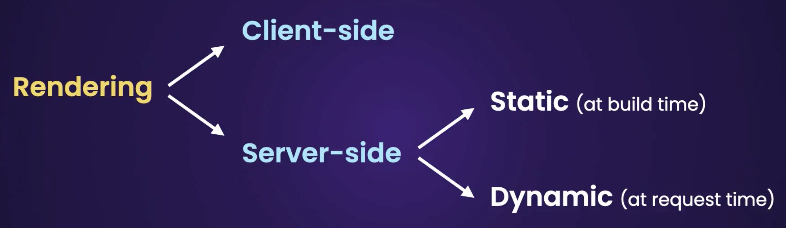

# Hands on NextJs 14+

NextJs technology is builded on top of ReactJs, it is a complete framework with all the necessary tools to build a fully fled application.

## Technologies

- NextJs 14.2.8
- React 18
- Tailwind 3.4+
- Typescript 5+
- fast-sort 3.4+
- zod 3.23+
- prisma 5.18+
- MySQL
- Cloudinary

## Topics

- Basic building blocks (file structure, page, layout, loadin, error, etc.)
- Routes (simple and complex)
- Navigation
- Building API

## API

Inside the file we can had either a `page.tsx` for UI or `route.tsx` for handling HTTP requests. But NOT BOTH. Inside `route.tsx` file, methods should be named as HTTP verbs ie. GET, POST, PUT, PATCH, etc.

```Ts
export function GET(request: NextRequest) {
    // some business logic
    return NextResponse.json(
        {
        // here the response object
        },
        {
            status: 200
        }
    )
}
```

### Routing

`ROUTING IS BASED ON THE FILE SYSTEM/STRUCTURE` that's why
Routing is based on convention, not configuration. For instance for `/users` path, create a folder under `App` named `users`. Inside users folder create

#### `params` keyword

It's used to access path variables or parameters.

- Path `users/id` ie users/1... or `users/3/cart/1`

Under `users` folder, create another folder named `[id]` and create `page.tsx` in order to access it. THIS ONLY WORK AT THE PAGE LEVEL. This process can be repeated for complex path like `users/1/cart/3` but this time `[id]` can't be used again for `cart`. Inside `cart` it is possible to access user `id` parameter.

```Ts
interface Props {
    params: { id: number} // Here 'id' should be the same name as set for the folder ie [id] (with square brackets) previously
}
// Pass this props to the functional component
```

- Path `users/cart/product/shoes`

`[...slug]` make extra path parts mendatory ie `/cart/...` part

`[[...slug]]` make extra path parts optional ie no need `/cart/product/...` part in order to work.

Here we are not going to create an heavy nested file structure. Instead we proceed like this. We create a folder named `[...slug]` then a file `page.tsx`, inside this file:

```Ts
interface Props {
    params: { slug: string[] } // The parameter is an array of strings, representing the complex path "users/cart/product/shoes" for instance
}
// Passed as component properties
```

#### `searchParams` keyword

It's used to access parameters like (brand) ie `cars?brand=mercedes`

```Ts
interface Props {
    searchParams: { brand: string }
}
// Pass the property to the component
```

#### Special Files in NextJs 14

- `page.tsx` file. Without this file this path/folder is not publicly accessible.
- `layout.tsx` file, for defining a common layout for our page.
- `loading.tsx` file, to show loading element when navigate on this route.
- `not-found.tsx` file, to show 404 path, custom error.
- `route.tsx` file, for creating APIs.
- `global-error.tsx` file, to catch errors even at the layout level.
- `error.tsx` file, for general errors - and should be rendered on client side (meaning usage of "use client" directive). `THIS COMPONENT WILL AUTOMATICALLY GET AN 'ERROR' OBJECT AS PROPS`.

Nested routes follow the same principle for routing.

### Directive

- `"use client"` is use on the first line (on top) of the component to mention that the component will need client interaction like click event.

### Navigation

Navigation is made using `<Link href="/path">Anchor</Ling>` for client side navigation.

#### Programmatic navigation

Programmatic navigation is made using `useRouter` hook from `next/navigation` package

```Ts
"use client";
import { useRouter } from "next/navigation";

const MyComponent = () => {
    const router = useRouter()

    return <>
        <button onClick={()=>router.push("/path-to-go")}>Navigate Somewhere</button>
    </button>
}
```

#### Programmatically show not found page

It is made using `notFound()` function from `next/navigation`.

```Ts
import { notFound } from "next/navigation";

const MyComponent = () => {
    // some code
    if(Condition) notFound();
    // other code
}
```

### Page Rendering



### Advanced Routing & Navigation

### Prisma integration

ALL Prisma CALLS ARE ASYNCHRONOUS

- `npx prisma init` to initiate the project with prisma

The [documentation](https://www.prisma.io/docs/orm/more/help-and-troubleshooting/help-articles/nextjs-prisma-client-dev-practices) is there to help.

To define models and relationship see the [Model documentation](https://www.prisma.io/docs/orm/prisma-schema/data-model/models)

After any model changed, we should run a migration.

- `npx prisma migrate dev` to run the migration in order to keep the database in sync with the models (For Relational databases).
- `npx prisma push` to run migration on None Relational databases like MongoDB for instance.
